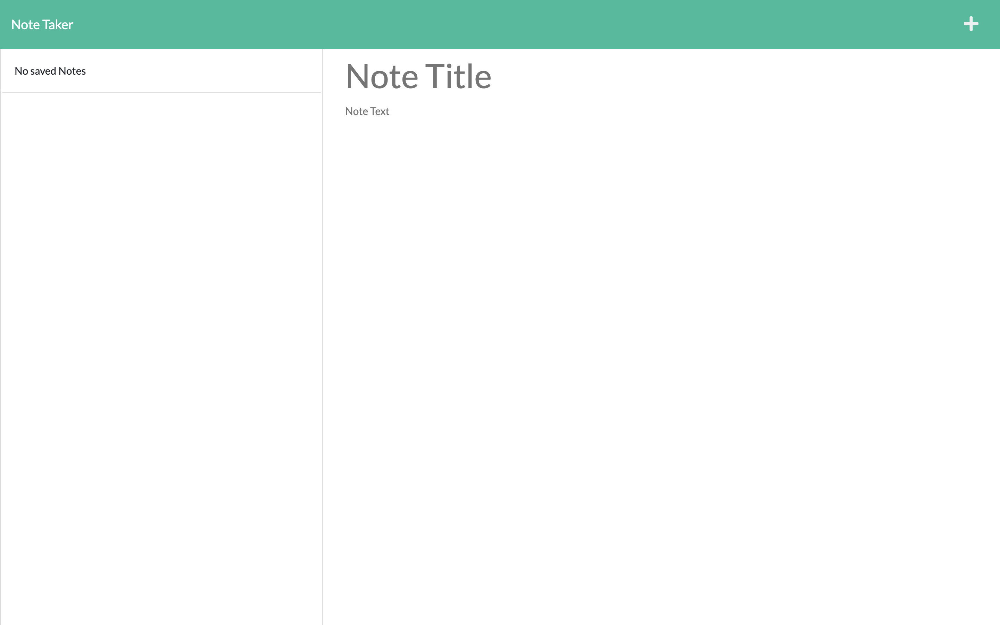

# Note Taker

## Description

This app was built on Node.js and utilized Express.js to facilitate routes to send gets/posts/deletes to the Note Taker app. These routes allow the user to send, save, & delete notes within the app. Try out the app to see its functionality 

## Technologies Used

-   Javascript
-   HTML
-   Node.js
-   Express.js
-   CSS
-   Heroku

## Screenshot

## Links to Application

-   Here is the repo: [Jon's Note Taker Repo](https://github.com/Jonchirinos/noteTaker)
-   Here is the Heroku App Page: [Jon's Note Taker App] (https://jon-note-taker.herokuapp.com/)
